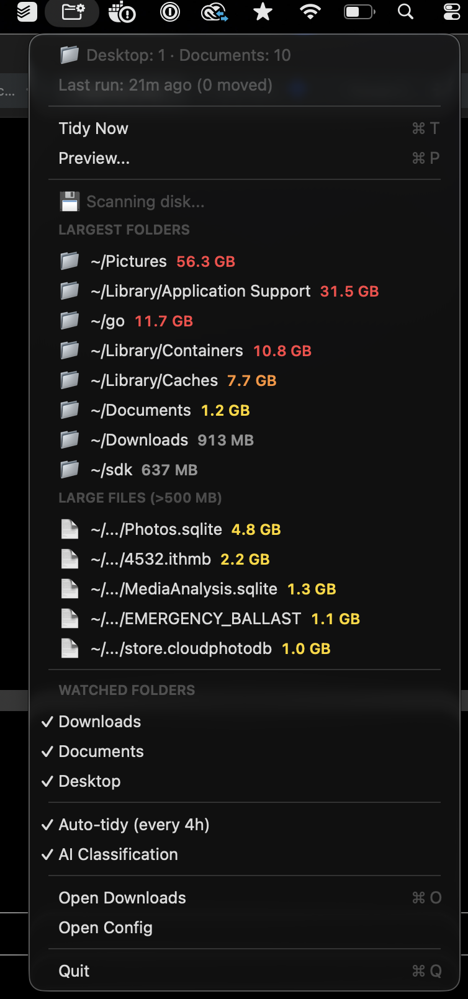

# sortwise

AI-powered file organizer for macOS. Uses Claude to understand what your files actually are — not just their extensions — and sorts them into intuitive categories like `receipts`, `travel`, `work`, `photos`, etc.

Comes with a **native macOS menu bar app** and a **disk usage monitor**.

<p align="center">
  
</p>

## How it works

1. Scans your folders for files (Downloads, Documents, Desktop — configurable)
2. Sends **only the filenames** to Claude Haiku for classification (~$0.001 per run)
3. Moves files into category subfolders (e.g. `~/Downloads/receipts/`, `~/Downloads/travel/`)
4. Archives anything older than 30 days into `_old/{category}/`

The AI understands context from filenames:

| File | Extension-based | AI-powered |
|------|----------------|------------|
| `Delta_FlightTicket_AB12CD.pdf` | documents | **travel** |
| `Receipt-2998-0321-9220.pdf` | documents | **receipts** |
| `Q3_Marketing_Strategy.pdf` | documents | **work** |
| `IMG_5341.PNG` | images | **photos** |
| `dreaming-outloud-pro-regular.zip` | archives | **design** |
| `vacation-budget-2026.xlsx` | documents | **personal** |

## Requirements

- **macOS** 12+
- **Python** 3.10+ (`python3 --version` to check)
- **pipx** (`brew install pipx` if not installed)
- **Xcode Command Line Tools** for the menu bar app (`xcode-select --install`)
- **Claude API key** from [console.anthropic.com](https://console.anthropic.com) (optional — works without AI too)

## Install

### Quick start

```bash
git clone https://github.com/fabioderiu/sortwise.git
cd sortwise
make app
```

This installs both the CLI and the native menu bar app to `/Applications`.

### CLI only

```bash
# From the repo
git clone https://github.com/fabioderiu/sortwise.git
cd sortwise
make install

# Or directly with pipx
pipx install git+https://github.com/fabioderiu/sortwise.git
```

### Setup your API key

```bash
sortwise --setup-key
# Paste your key when prompted
```

Or set it as an environment variable:

```bash
export ANTHROPIC_API_KEY=sk-ant-...
```

> **No API key?** The tool works without one — use `--no-ai` for free extension-based sorting.

## Usage

### CLI

```bash
# Preview what it would do (dry-run, default)
sortwise

# Actually move files
sortwise --move

# Organize a specific folder
sortwise --dir Documents

# Use extension-based sorting (free, no API key)
sortwise --no-ai

# Change age threshold for archiving
sortwise --move --age-days 14

# Enable/disable folders for auto-tidy
sortwise --enable Documents
sortwise --enable Desktop
sortwise --disable Desktop
```

### Menu bar app

After `make app`, open **Sortwise** from Applications or Spotlight. A native icon appears in your menu bar:

- **Tidy Now** — organize all enabled folders immediately
- **Preview** — dry-run via macOS notification
- **Disk Usage** — see your largest folders and files, click any to reveal in Finder
- **Watched Folders** — toggle Downloads, Documents, Desktop
- **Auto-tidy** — runs every 4 hours when enabled
- **AI Classification** — toggle between AI and extension-based sorting

#### Launch at login

System Settings → General → Login Items → add **Sortwise**.

#### Uninstall the app

```bash
make app-uninstall
```

### Headless auto-tidy (launchd)

If you prefer the CLI running on a schedule without the menu bar app:

```bash
make launchd-install    # every 4 hours
make launchd-uninstall  # remove
```

## Example output

```
  🧹 sortwise v0.1.0

  Classifying with AI sorting...
  Watching: ~/Downloads, ~/Documents

  📂 ~/Downloads (95 items)
  [DRY RUN] 95 files to organize:

  📁 receipts/
     ↳ Receipt-2998-0321-9220.pdf
     ↳ Transaction-Mar-2026.pdf
  📁 travel/
     ↳ Delta_FlightTicket_AB12CD.pdf
     ↳ Airbnb_Confirmation_Tokyo.pdf
  📁 work/
     ↳ Q3_Marketing_Strategy.pdf
     ↳ Sales_Report_2026.pdf
  📁 photos/
     ↳ IMG_5341.PNG
     ↳ IMG_5342.PNG
  📁 _old/archives/
     ↳ old-project-backup.zip

  📂 ~/Documents (14 items)
  Already tidy!

  Run with --move to execute.
```

## How much does it cost?

Each run sends only filenames (not file contents) to Claude Haiku. A typical run with ~100 files costs **less than $0.001**. Running every 4 hours, that's about **$0.07/month**.

Use `--no-ai` for completely free extension-based sorting.

## Configuration

Config is stored at `~/.config/sortwise/config.json`:

```json
{
  "api_key": "sk-ant-...",
  "watched_dirs": {
    "Downloads": true,
    "Documents": false,
    "Desktop": false
  },
  "use_ai": true,
  "auto_enabled": true,
  "auto_interval_minutes": 240
}
```

## How is this different from Hazel / other tools?

| | sortwise | Hazel | Built-in Stacks |
|---|---|---|---|
| **AI classification** | Understands file purpose from name | Rule-based only | Extension only |
| **Cost** | ~$0.07/month (or free with `--no-ai`) | $42 one-time | Free |
| **Open source** | Yes (MIT) | No | No |
| **Menu bar app** | Native Swift, ~40 MB RAM | Yes | N/A |
| **Disk usage monitor** | Built-in | No | No |
| **Multi-folder** | Downloads, Documents, Desktop | Any folder | Desktop only |
| **Dry-run mode** | Default behavior | No | No |

## Uninstall

```bash
cd sortwise
make uninstall        # remove CLI
make app-uninstall    # remove menu bar app
make launchd-uninstall # remove auto-tidy schedule
```

Config is stored at `~/.config/sortwise/` — delete it to remove all settings.

## License

MIT
